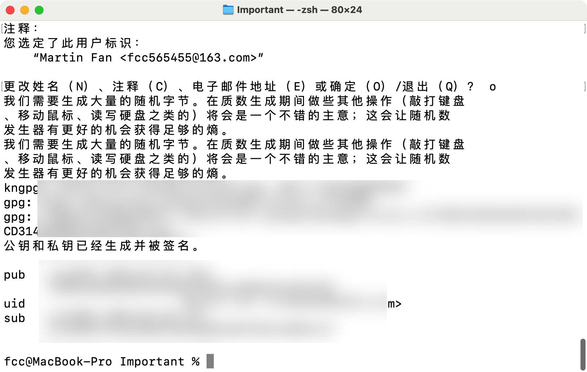
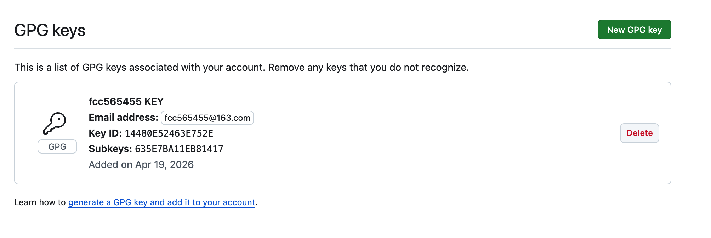

# 学习使用GPG密钥签名

## 前言

我突然发现最近github提交不显示我的贡献了，原来是我换绑了邮箱，于是我在Github账户里添加了现在的邮箱。

随后我又想了解一下GPG对commit签名，没啥用但就是很高级，能证明你是你，由于Git去中心化设计，理论上来说任何人都可以伪造你的身份。

## 生成GPG密钥

```bash
brew install gnupg
gpg --full-generate-key
```

随后开始生成密钥

- Key type: 选择 (1) RSA and RSA。
- Key size: 选择 4096。
- Expiration: 输入 0（永不过期）或设置你想要的期限（例如 2y）。
- Real name: 填你的名字。
- Email address: 非常重要，必须填写你 GitHub 账号中绑定的邮箱。
- Passphrase: 设置一个密码（以后每次签名都需要输入它）。

## 导出公钥

```bash
gpg --list-secret-keys --keyid-format=long
```

拿到keyID

```bash
sec   rsa4096/ABC1234567890DEF 2026-04-19 [SC]
uid                 [ultimate] Your Name <your-email@example.com>
```

其中的 `ABC1234567890DEF` 就是你的 Key ID。

导出公钥

```bash
gpg --armor --export ABC1234567890DEF
```

## 上传公钥

最后上传这个公钥到Github，Gitlab，Gitea之类的即可。

以后提交要记得使用-S参数

```bash
git commit -S -m "这是一个带签名的重要更新"
```

附图





## 常见错误

报错如下

```bash
fcc@MacBook-Pro statics % git commit -S -m "gpg.md file"
error: gpg failed to sign the data:
[GNUPG:] KEY_CONSIDERED 19D5CA35E84B5F68FA857CD314480E52463E752E 2
[GNUPG:] BEGIN_SIGNING H8
[GNUPG:] PINENTRY_LAUNCHED 28464 curses 1.3.2 - xterm-256color - - 501/20 0
gpg: 签名时失败： Inappropriate ioctl for device
[GNUPG:] FAILURE sign 83918950
gpg: signing failed: Inappropriate ioctl for device
```

需要配置输入密码方式 修改`~/.zshrc`（使用你的命令行配置文件）

添加如下内容

```plain
export GPG_TTY=$(tty)
```

重新加载配置

```bash
source ~/.zshrc
```

应该就能解决问题。使用愉快~

FANCC，20260419
